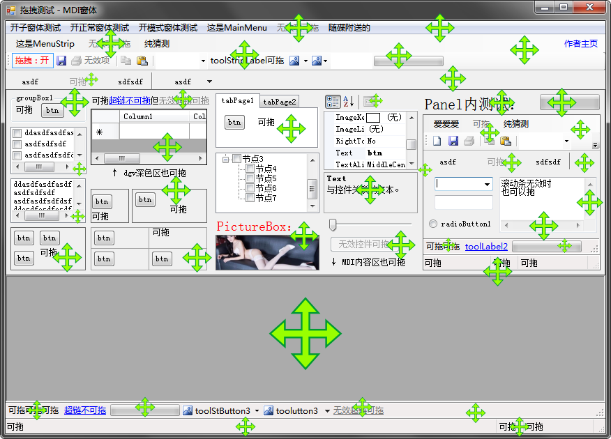

# FormDragger
一个可在窗体内随意拖动窗体的方案。可拖动区域包括不限于Form/Panel/GroupBox/TabControl等空白区域、Label、无效控件、无效菜单/工具栏项、状态栏等等任何你觉得可以拖动的地方。
A solution for easily dragging window within client area nor children control. The range of dragging includes but not limited to blank areas, like Form/Panel/GroupBox/TabControl, also includes anywhere you can drag such as Label, disabled Controls/MenuItems/ToolStripItems, menu/toolbar and status bar. etc.

